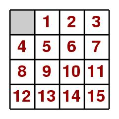

NTOU CSE Class AI Lab2
Source: [Book] Artificial Intelligence: A Modern Approach

A* algorithm
│ 4│ 1│ 2│ 3│
│ 5│ 6│ 7│11│ 
│ 8│ 9│10│15│
│12│13│14│ 0│
      cost1=0(5)+4(1)+5(1)+6(1)+7(1)+11(1)+14(1)+15(1)=12
      │ 4│ 1│ 2│ 3│
      │ 5│ 6│ 7│11│
      │ 8│ 9│10│15│
      │12│13│ 0│14│
      cost2=0(5)+4(1)+5(1)+6(1)+7(1)+11(1)=10 cost2 < cost1
      │ 4│ 1│ 2│ 3│
      │ 5│ 6│ 7│11│
      │ 8│ 9│10│ 0│
      │12│13│14│15│
            cost3=0(4)+4(1)+5(1)+6(1)+7(1)+10(1)+11(1)=10
            │ 4│ 1│ 2│ 3│
            │ 5│ 6│ 7│11│
            │ 8│ 9│0│ 10│
            │12│13│14│15│
            cost4=0(4)+4(1)+5(1)+6(1)+7(1)=8 cost4 < cost3 < cost1
            │ 4│ 1│ 2│ 3│
            │ 5│ 6│ 7│ 0│
            │ 8│ 9│10│11│
            │12│13│14│15│
                  cost5=0(3)+3(1)+4(1)+5(1)+6(1)+7(1)=8
                  │ 4│ 1│ 2│ 0│
                  │ 5│ 6│ 7│ 3│
                  │ 8│ 9│10│11│
                  │12│13│14│15│
                  cost6=0(3)+4(1)+5(1)+6(1)=6 cost6 < cost5 < cost3 < cost1
                  │ 4│ 1│ 2│ 3│
                  │ 5│ 6│ 0│7│
                  │ 8│ 9│10│ 11│
                  │12│13│14│15│
                        cost7=0(2)+2(1)+4(1)+5(1)+6(1)+7(1)=7
                        │ 4│ 1│ 0│ 3│
                        │ 5│ 6│ 2│ 7│
                        │ 8│ 9│10│11│
                        │12│13│14│15│
                        cost8=0(2)+4(1)+5(1)=4 cost8 < cost7 < cost5 < cost9 < cost3 < cost1
                        │ 4│ 1│ 2│ 3│
                        │ 5│ 0│ 6│ 7│
                        │ 8│ 9│10│11│
                        │12│13│14│15│
                        cost9=0(4)+4(1)+5(1)+6(1)+7(1)+10(1)=9
                        │ 4│ 1│ 2│ 3│
                        │ 5│ 6│10│ 7│
                        │ 8│ 9│ 0│11│
                        │12│13│14│15│

The 15-puzzle is a sliding puzzle that consists of a frame of numbered
square tiles in random order with one tile missing.
The puzzle also exists in other sizes, particularly the smaller 8-puzzle.
If the size is 3x3 tiles, the puzzle is called the 8-puzzle or 9-puzzle, and
if 4x4 tiles, the puzzle is called the 15-puzzle or 16-puzzle named,
respectively, for the number of tiles and the number of spaces.

The object of the puzzle is to place the tiles in order by making sliding
moves that use the empty space.
The n-puzzle is a classical problem for modelling algorithms involving
heuristics.

Commonly used heuristics for this problem are:

H1: counting the number of misplaced tiles, and
H2: finding the sum of the Manhattan distances between each block
      and its position in the goal configuration
